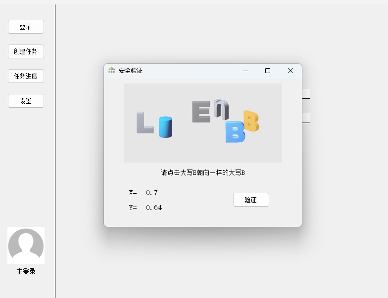

# 智慧树刷课脚本
> 本项目供学习交流使用，使用本项目造成的一切后果自行承担
## 功能
**支持的课程**
- **共享学分课**
- **校内学分课(未测试)**

**脚本有两种模式：**
- **图形化模式**
- **终端模式**
#### 图形化模式
- **cookies登录**
- **账号密码登录**
- **扫码登录**
- **自动刷课**
- **安全验证**
- **限制刷课时间和数量**
#### 终端模式
- **cookies登录**
- **账号密码自动登录**
- **自动刷课**

## 配置文件
```ini
[user]
# 命令行登录时需要填入用户名和密码
username =
password =

# 以下内容为可选配置，不了解不要修改
[settings]
# 是否保存用户登录cookies
save_cookies = true
# 错误重试次数
error_retry = 1
# 是否启用日志
enable_log = true
# 启用的日志等级(使用','分隔)
enable_log_level = debug,info,warning,error,critical
# 打印信息等级日志
print_info_level = true

[data]
# 描述文件路径
description_path = data/description.json
# 保存cookies的路径
cookies_path = data/cookies.json
# 任务数据文件路径
tasks_path = data/tasks.json
# 日志文件夹路径
log_folder = log/

# 以下内容一般为常量，不了解不要修改
[encrypt]
# 验证码参数
login_captcha_id = 75f9f716460a422f89a628f50fd8cc2b
login_captcha_v = af2952a4

# AES加密参数
AES_IV = 1g3qqdh4jvbskb9x
COURSE_AES_KEY = 7q9oko0vqb3la20r
STUDY_AES_KEY = azp53h0kft7qi78q
QA_AES_KEY = w1k5ntxecb8wmbc2

# ev加密参数
# D26666：学分课, D24444：见面课
D26666_KEY = zzpttjd
D24444_KET = zhihuishu
```
> 如果想关闭debug，可以将`enable_log_level`中的`debug`删除

## 源码运行

> 请确保已经安装了python3.10.10及以上版本

#### 安装依赖
```bash
pip install -r requirements.txt
```

#### 图形化模式运行
```bash
python main.py
```

#### 终端模式运行
```bash
python main.py --cmd
```

## 可执行文件运行
> 仅支持windows平台，且不支持终端模式

- #### 下载
    前往`release`页面下载最新版本

- #### 运行
  - 解压至任意目录
  - 双击`zhihuishu.exe`即可运行

> 第一次运行会生成配置文件，配置文件路径为项目目录下的`config.ini`文件，请根据自己的需求修改配置文件

## 一些说明
### cookies
由于cookies中包含了用户的登录凭证，所以请不要将cookies泄露给他人
### 异地登录问题
如果异地或黑名单登录，会提示“登录失败, 需要空间推理验证”，请使用图形化模式验证，或在同一网络环境内登录网页验证。

